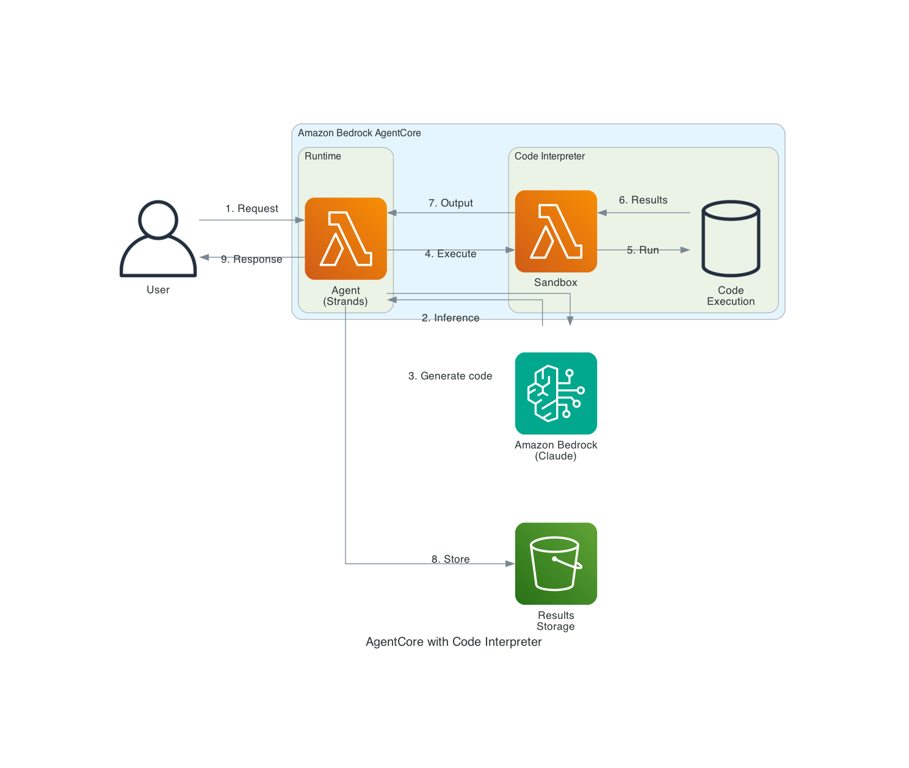

# AgentCore with Code Interpreter

This blueprint deploys an AI agent to Amazon Bedrock AgentCore with the Code Interpreter tool. The agent can write and execute Python code securely in isolated sandbox environments, enabling complex calculations, data analysis, and visualization generation.



## Architecture Overview

1. **User** sends a request requiring computation or data analysis
2. **AgentCore Runtime** hosts the agent with serverless scaling
3. **Agent (Strands)** processes the request using Amazon Bedrock foundation models
4. **Code Interpreter** executes generated code in an isolated sandbox:
   - Secure execution environment with resource limits
   - Support for Python with common data science libraries
   - File system access for reading/writing data
5. **Results** are returned to the user (text, data, or visualizations)

## Prerequisites

- AWS Account with Amazon Bedrock model access enabled
- Python 3.10+
- AWS CLI configured with appropriate credentials
- AgentCore Starter Toolkit installed

## Deployment

### 1. Install dependencies

```bash
python -m venv .venv
source .venv/bin/activate
pip install "bedrock-agentcore-starter-toolkit>=0.1.21" strands-agents strands-agents-tools boto3
```

### 2. Create the agent code

Create `agent.py`:

```python
import os
from strands import Agent
from strands_tools.code_interpreter import AgentCoreCodeInterpreter
from bedrock_agentcore.runtime import BedrockAgentCoreApp

app = BedrockAgentCoreApp()

REGION = os.getenv("AWS_REGION")
MODEL_ID = "us.anthropic.claude-sonnet-4-5-20250929-v1:0"

@app.entrypoint
def invoke(payload, context):
    session_id = getattr(context, 'session_id', 'default')
    
    # Create code interpreter tool
    code_interpreter = AgentCoreCodeInterpreter(
        region=REGION,
        session_name=session_id,
        auto_create=True,
        persist_sessions=True
    )
    
    # Create agent with code interpreter
    agent = Agent(
        model=MODEL_ID,
        system_prompt="""You are a helpful data analyst assistant with code execution capabilities.
        When asked to perform calculations, analyze data, or create visualizations, 
        use the code_interpreter tool to write and execute Python code.""",
        tools=[code_interpreter.code_interpreter]
    )
    
    result = agent(payload.get("prompt", ""))
    return {"response": str(result)}

if __name__ == "__main__":
    app.run()
```

Create `requirements.txt`:

```
strands-agents
strands-agents-tools
bedrock-agentcore
```

### 3. Configure and deploy

```bash
# Configure the agent
agentcore configure -e agent.py

# Deploy to AgentCore Runtime
agentcore launch
```

### 4. Test the agent

```bash
# Simple calculation
agentcore invoke '{"prompt": "Calculate the compound interest on $10,000 at 5% for 10 years"}'

# Data analysis
agentcore invoke '{"prompt": "Generate a list of 100 random numbers and calculate their mean, median, and standard deviation"}'

# Visualization
agentcore invoke '{"prompt": "Create a bar chart showing sales data: Q1=100, Q2=150, Q3=120, Q4=200"}'
```

## Cleanup

```bash
agentcore destroy
```

## Cost Considerations

- AgentCore Runtime: Pay per invocation and compute time
- Code Interpreter: Pay for sandbox execution time
- Amazon Bedrock: Pay per token for model inference

## Resources

- [AgentCore Code Interpreter Documentation](https://docs.aws.amazon.com/bedrock-agentcore/latest/devguide/code-interpreter-tool.html)
- [AgentCore Samples - Code Interpreter Tutorial](https://github.com/awslabs/amazon-bedrock-agentcore-samples/tree/main/01-tutorials/05-AgentCore-tools)
- [Strands Agents Documentation](https://strandsagents.com/)
