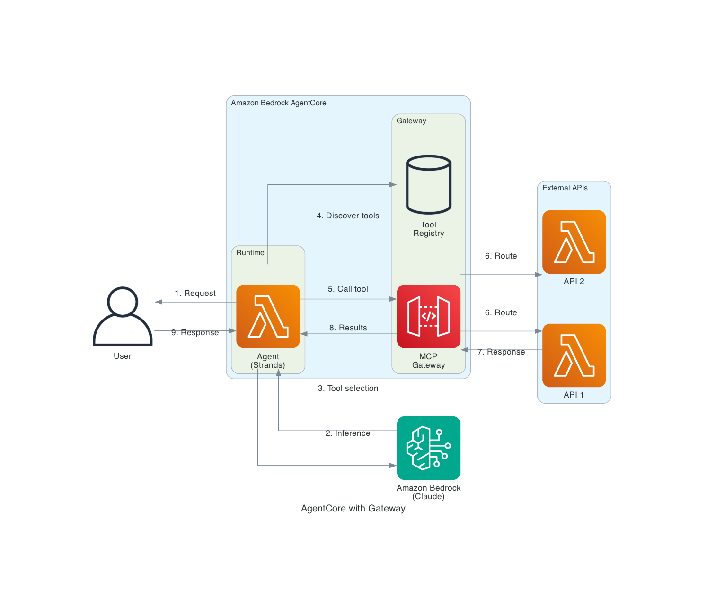

# AgentCore with Gateway

This blueprint deploys an AI agent to Amazon Bedrock AgentCore with Gateway integration. The Gateway transforms your existing APIs into agent-compatible tools, enabling agents to discover and invoke external services through a unified MCP (Model Context Protocol) interface.



## Architecture Overview

1. **User** sends a request to the deployed agent
2. **AgentCore Runtime** hosts the agent with serverless scaling
3. **Agent (Strands)** processes the request using Amazon Bedrock foundation models
4. **AgentCore Gateway** provides tool discovery and invocation:
   - Transforms OpenAPI specs into MCP-compatible tools
   - Routes requests to appropriate backend APIs
   - Handles authentication and authorization
5. **External APIs** execute the actual business logic
6. **Results** are returned through the gateway to the agent

## Prerequisites

- AWS Account with Amazon Bedrock model access enabled
- Python 3.10+
- AWS CLI configured with appropriate credentials
- AgentCore Starter Toolkit installed
- OpenAPI specification for your APIs (optional)

## Deployment

### 1. Install dependencies

```bash
python -m venv .venv
source .venv/bin/activate
pip install "bedrock-agentcore-starter-toolkit>=0.1.21" strands-agents boto3
```

### 2. Create a sample Lambda function (backend API)

Create `lambda_function.py`:

```python
import json

def handler(event, context):
    """Sample API that returns weather data."""
    city = event.get('city', 'Seattle')
    
    # Mock weather data
    weather_data = {
        "Seattle": {"temp": 55, "condition": "Cloudy"},
        "New York": {"temp": 72, "condition": "Sunny"},
        "London": {"temp": 60, "condition": "Rainy"}
    }
    
    data = weather_data.get(city, {"temp": 70, "condition": "Unknown"})
    return {
        "statusCode": 200,
        "body": json.dumps({
            "city": city,
            "temperature": data["temp"],
            "condition": data["condition"]
        })
    }
```

### 3. Create the agent code

Create `agent.py`:

```python
import os
from strands import Agent
from bedrock_agentcore.runtime import BedrockAgentCoreApp
from bedrock_agentcore.gateway import AgentCoreGatewayClient

app = BedrockAgentCoreApp()

REGION = os.getenv("AWS_REGION")
GATEWAY_ID = os.getenv("BEDROCK_AGENTCORE_GATEWAY_ID")
MODEL_ID = "us.anthropic.claude-sonnet-4-5-20250929-v1:0"

@app.entrypoint
def invoke(payload, context):
    # Initialize gateway client
    gateway_client = AgentCoreGatewayClient(
        gateway_id=GATEWAY_ID,
        region=REGION
    )
    
    # Get tools from gateway
    tools = gateway_client.get_tools()
    
    # Create agent with gateway tools
    agent = Agent(
        model=MODEL_ID,
        system_prompt="""You are a helpful assistant with access to external APIs.
        Use the available tools to fetch real-time data when needed.""",
        tools=tools
    )
    
    result = agent(payload.get("prompt", ""))
    return {"response": str(result)}

if __name__ == "__main__":
    app.run()
```

Create `requirements.txt`:

```
strands-agents
bedrock-agentcore
```

### 4. Configure Gateway and deploy

```bash
# Create gateway with your OpenAPI spec
agentcore gateway create --name my-gateway --spec openapi.yaml

# Configure the agent
agentcore configure -e agent.py

# Deploy to AgentCore Runtime
agentcore launch
```

### 5. Test the agent

```bash
# Query using gateway tools
agentcore invoke '{"prompt": "What is the weather in Seattle?"}'

# Multi-tool query
agentcore invoke '{"prompt": "Compare the weather in Seattle and New York"}'
```

## Cleanup

```bash
agentcore destroy
agentcore gateway delete --name my-gateway
```

## Cost Considerations

- AgentCore Runtime: Pay per invocation and compute time
- AgentCore Gateway: Pay for API calls routed through gateway
- Lambda: Pay for function invocations
- Amazon Bedrock: Pay per token for model inference

## Resources

- [AgentCore Gateway Documentation](https://docs.aws.amazon.com/bedrock-agentcore/latest/devguide/gateway.html)
- [AgentCore Samples - Gateway Tutorial](https://github.com/awslabs/amazon-bedrock-agentcore-samples/tree/main/01-tutorials/02-AgentCore-gateway)
- [MCP Protocol Documentation](https://modelcontextprotocol.io/)
