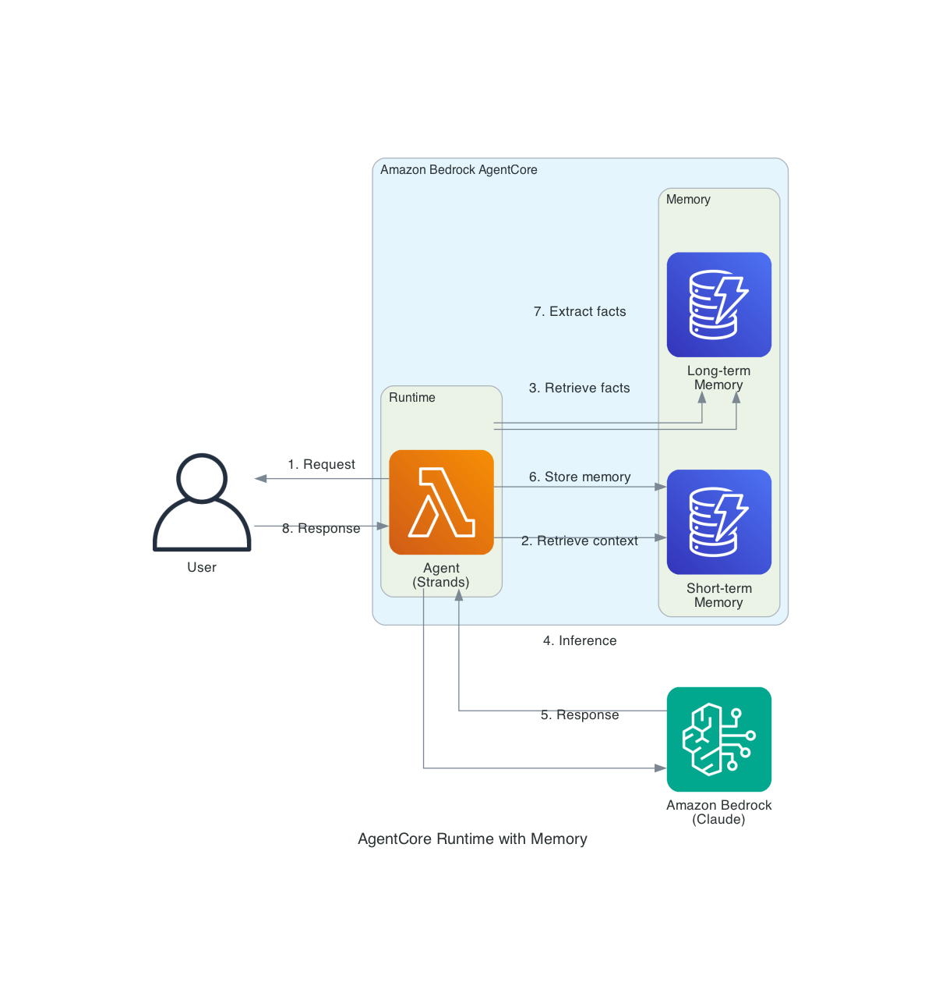

# AgentCore Runtime with Memory

This blueprint deploys an AI agent to Amazon Bedrock AgentCore Runtime with integrated memory capabilities. The agent maintains context across conversations using short-term memory (within sessions) and long-term memory (across sessions) for personalized, context-aware interactions.



## Architecture Overview

1. **User** sends a request to the deployed agent endpoint
2. **AgentCore Runtime** hosts the agent with serverless scaling and session isolation
3. **Agent (Strands)** processes the request using Amazon Bedrock foundation models
4. **AgentCore Memory** stores and retrieves conversation context:
   - Short-term memory: Recent conversation history within the session
   - Long-term memory: Extracted facts and preferences across sessions
5. **Response** is returned to the user with context-aware information

## Prerequisites

- AWS Account with Amazon Bedrock model access enabled
- Python 3.10+
- AWS CLI configured with appropriate credentials
- AgentCore Starter Toolkit installed

## Deployment

### 1. Install dependencies

```bash
python -m venv .venv
source .venv/bin/activate
pip install "bedrock-agentcore-starter-toolkit>=0.1.21" strands-agents boto3
```

### 2. Create the agent code

Create `agent.py`:

```python
import os
from strands import Agent
from bedrock_agentcore.memory.integrations.strands.config import (
    AgentCoreMemoryConfig, 
    RetrievalConfig
)
from bedrock_agentcore.memory.integrations.strands.session_manager import (
    AgentCoreMemorySessionManager
)
from bedrock_agentcore.runtime import BedrockAgentCoreApp

app = BedrockAgentCoreApp()

MEMORY_ID = os.getenv("BEDROCK_AGENTCORE_MEMORY_ID")
REGION = os.getenv("AWS_REGION")
MODEL_ID = "us.anthropic.claude-sonnet-4-5-20250929-v1:0"

@app.entrypoint
def invoke(payload, context):
    session_id = getattr(context, 'session_id', 'default')
    
    # Configure memory
    session_manager = None
    if MEMORY_ID:
        session_manager = AgentCoreMemorySessionManager(
            AgentCoreMemoryConfig(
                memory_id=MEMORY_ID,
                session_id=session_id,
                actor_id="user",
                retrieval_config={
                    "/users/user/facts": RetrievalConfig(top_k=5, relevance_score=0.5),
                }
            ),
            REGION
        )
    
    # Create agent with memory
    agent = Agent(
        model=MODEL_ID,
        session_manager=session_manager,
        system_prompt="You are a helpful assistant that remembers user preferences."
    )
    
    result = agent(payload.get("prompt", ""))
    return {"response": str(result)}

if __name__ == "__main__":
    app.run()
```

Create `requirements.txt`:

```
strands-agents
bedrock-agentcore
```

### 3. Configure and deploy

```bash
# Configure the agent (select 'yes' for long-term memory when prompted)
agentcore configure -e agent.py

# Deploy to AgentCore Runtime
agentcore launch
```

### 4. Test the agent

```bash
# Store information
agentcore invoke '{"prompt": "My name is Alice and I prefer dark mode"}'

# Retrieve within same session
agentcore invoke '{"prompt": "What is my name?"}'

# Test long-term memory (new session)
sleep 20
SESSION_ID=$(python -c "import uuid; print(uuid.uuid4())")
agentcore invoke '{"prompt": "What do you remember about me?"}' --session-id $SESSION_ID
```

## Cleanup

```bash
agentcore destroy
```

## Cost Considerations

- AgentCore Runtime: Pay per invocation and compute time
- AgentCore Memory: Pay for storage and retrieval operations
- Amazon Bedrock: Pay per token for model inference

## Resources

- [AgentCore Memory Documentation](https://docs.aws.amazon.com/bedrock-agentcore/latest/devguide/memory.html)
- [AgentCore Samples - Memory Tutorial](https://github.com/awslabs/amazon-bedrock-agentcore-samples/tree/main/01-tutorials/04-AgentCore-memory)
- [Strands Agents Documentation](https://strandsagents.com/)
