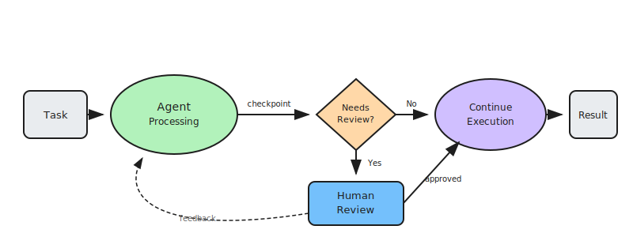

# Human-in-the-Loop: Supervised Autonomy

Human-in-the-Loop (HITL) is a design pattern that introduces human oversight at specific junctures within an otherwise automated agent workflow. Unlike fully autonomous systems, HITL systems pause execution at designated checkpoints to request human approval, correction, or guidance before proceeding with critical actions.

This pattern balances the efficiency of automation with the judgment, accountability, and contextual understanding that humans provide. It's essential for high-stakes decisions, regulatory compliance, and building trust in AI systems while they learn and improve.

## How it works

1. **Agent processes task**: The agent autonomously handles routine steps of the workflow using its reasoning and tools
2. **Reach checkpoint**: When the agent encounters a predefined trigger (high-stakes action, low confidence, policy requirement), it pauses execution
3. **Request human input**: The agent presents the situation, its proposed action, and relevant context to a human reviewer
4. **Human reviews and decides**: The human approves, modifies, or rejects the proposed action, potentially providing additional guidance
5. **Resume execution**: The agent incorporates the human decision and continues processing, learning from the feedback when applicable

## Examples

- **Financial transactions**: Agent prepares wire transfer → Pauses for approval on amounts over threshold → Human approves → Transaction executes
- **Content moderation**: Agent flags potentially problematic content → Human reviews edge cases → Decision recorded for future training
- **Medical diagnosis**: Agent analyzes symptoms and suggests diagnosis → Physician reviews and confirms → Treatment plan proceeds
- **Code deployment**: Agent prepares production deployment → Engineer reviews changes → Approves or requests modifications
- **Customer escalation**: Agent handles routine inquiries → Escalates complex issues to human → Human resolves and agent learns

## Best for

- High-stakes decisions where errors have significant consequences
- Regulatory or compliance requirements mandating human oversight
- Edge cases and novel situations outside the agent's training
- Building trust during initial deployment of autonomous systems
- Scenarios requiring accountability and audit trails
- Continuous improvement through human feedback and correction
