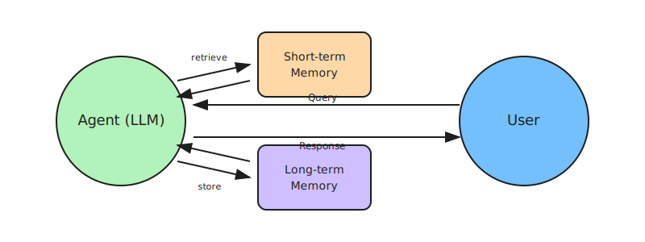

# Memory-Augmented Agents

Memory-Augmented Agents are enhanced with the ability to store, retrieve, and reason using both short-term and long-term memory. This allows them to maintain context across multiple tasks, sessions, and interactions—producing more coherent, personalized, and strategically aligned responses.

Unlike stateless agents that treat each interaction independently, memory-augmented agents adapt by referencing historical data, learn from prior outcomes, and make decisions that align with the user's evolving goals, preferences, and environment.

## How it works

1. **Receive input**: The agent receives a user query or system event (text, API trigger, or environmental change)
2. **Retrieve short-term memory**: The agent accesses recent conversational history, task context, or system state relevant to the current session
3. **Retrieve long-term memory**: The agent queries persistent storage (vector databases, key-value stores) for historical insights: user preferences, past decisions, learned concepts, and prior outcomes
4. **Reason with context**: Memory context is embedded into the LLM prompt, enabling the agent to reason based on both current inputs and accumulated knowledge
5. **Generate response**: The agent produces a contextually aware response personalized according to task history and user patterns
6. **Update memory**: New information (goals, outcomes, structured responses) is stored for future reference

## Examples

- **Personal assistant**: Remembers user preferences → "You usually prefer morning meetings, should I schedule this for 9 AM?"
- **Learning tutor**: Tracks progress → "Last time you struggled with recursion, let's review that concept before moving on"
- **Customer support**: Recalls history → "I see you contacted us about this issue last week. Let me check what was resolved"
- **Coding copilot**: Maintains codebase context → "Based on your project's architecture patterns, here's a consistent implementation"
- **Research agent**: Avoids redundancy → "I already searched this topic yesterday. Here's what I found, plus new updates"

## Best for

- Conversational applications requiring continuity across sessions
- Personalized experiences that adapt to individual user preferences
- Long-running workflows where context must persist over time
- Applications where learning from past interactions improves outcomes
- Scenarios requiring goal persistence and progress tracking
- Systems that benefit from avoiding redundant work or queries
