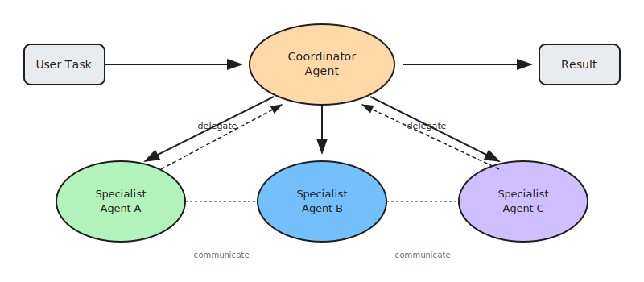

# Multi-Agent Orchestration

Multi-Agent Orchestration is a pattern where multiple autonomous agents, each with a distinct role, specialization, or objective, work together to solve complex tasks. These agents may operate independently or collaborate by sharing information, dividing responsibilities, and collectively reasoning toward a common goal.

This pattern enables tackling problems that are too complex, dynamic, or multifaceted for a single agent. By distributing cognitive load across specialized agents, the system gains flexibility, resilience, and the ability to handle diverse domains simultaneously.

## How it works

1. **Initiate task**: A user or system emits a high-level goal or problem. A coordinator or initiating agent defines the objective
2. **Assign roles**: Agents self-assign or are delegated to specific roles (planner, researcher, executor, critic, validator) based on the task requirements
3. **Communicate**: Agents exchange information through shared memory, message queues, or direct invocation. They may debate, query, or propose subtasks to one another
4. **Specialized reasoning**: Each agent applies its own model or domain logic to solve its portion of the problem using role-specific prompts and context
5. **Coordinate outputs**: Agents synthesize their contributions into a final answer, plan, or action. A supervising agent may validate or summarize the result

## Examples

- **Research teams**: Search agent finds sources → Summarizer extracts key points → Validator checks accuracy → Final report generated
- **Software development**: Planner designs architecture → Coder implements features → Tester validates functionality → Reviewer ensures quality
- **Customer service**: Triage agent classifies request → Specialist agent handles domain → Escalation agent involves humans when needed
- **Content creation**: Research agent gathers facts → Writer creates draft → Editor refines content → Fact-checker validates claims
- **Data analysis**: Collector gathers data → Analyst processes patterns → Visualizer creates charts → Narrator explains insights

## Best for

- Complex problems requiring diverse expertise or perspectives
- Tasks that benefit from parallel processing and specialization
- Scenarios where different reasoning approaches should be combined
- Workflows requiring checks, balances, and validation steps
- Open-ended domains where emergent collaboration adds value
- Enterprise processes spanning multiple domains (finance, legal, technical)
