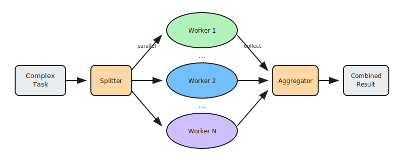

# Parallelization: Concurrent Task Execution

Parallelization is a workflow pattern that breaks down a task into independent subtasks that can be processed simultaneously by multiple LLM calls or agents. The outputs are then programmatically aggregated and synthesized into a unified result.

This pattern is essential when dealing with data-heavy, batch-oriented, or multi-perspective problems where sequential processing would be too slow. By executing independent operations concurrently, agents can dramatically reduce latency and increase throughput while maintaining quality.

## How it works

1. **Receive task**: The orchestrator receives a complex task that can be decomposed into independent parts
2. **Decompose into subtasks**: The task is split into multiple independent subtasks that don't depend on each other's intermediate results
3. **Execute in parallel**: Each subtask is dispatched to separate LLM calls or agents that run concurrently
4. **Collect results**: As each parallel execution completes, results are gathered and validated
5. **Aggregate and synthesize**: Results are combined, deduplicated if needed, and synthesized into a coherent final output

## Examples

- **Document analysis**: Analyze 50 documents simultaneously → Extract key points from each → Synthesize into comprehensive summary
- **Multi-perspective evaluation**: Evaluate proposal from legal, financial, and technical angles in parallel → Combine into unified assessment
- **Batch classification**: Classify thousands of support tickets concurrently → Aggregate statistics and route appropriately
- **Diverse generation**: Generate 5 different marketing copy variations simultaneously → Select or combine best elements
- **Research synthesis**: Search multiple sources in parallel → Extract relevant information → Merge into cohesive report

## Best for

- Processing large batches of similar items (documents, records, requests)
- Tasks requiring multiple independent perspectives or analyses
- High-throughput scenarios where latency is critical
- Generating diverse outputs for comparison or selection
- Workloads that can be cleanly divided into non-dependent subtasks
- Scalable systems that need to handle variable load efficiently
