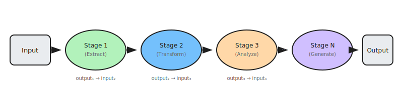

# Prompt Chaining: Sequential Task Decomposition

Prompt Chaining (also known as the Pipeline pattern) decomposes complex tasks into a sequence of discrete steps, where each step is a separate LLM invocation that processes or builds upon the output of the previous one. This creates a structured pipeline of reasoning stages.

This pattern excels when tasks require logical progression through multiple phases, where intermediate outputs inform subsequent decisions. By breaking complex reasoning into manageable steps, agents achieve greater reliability, interpretability, and control over the overall process.

## How it works

1. **Receive complex task**: The agent receives a task that exceeds the reasoning depth or context window of a single LLM call
2. **Decompose into stages**: The task is broken into logical sequential steps, each with a focused objective
3. **Execute first stage**: The first LLM call processes the initial input and produces an intermediate output
4. **Chain to next stage**: The output is formatted and passed as input to the next stage, potentially with additional context or instructions
5. **Continue through pipeline**: Each subsequent stage builds on previous outputs until the final result is produced

## Examples

- **Research workflow**: Search for sources → Extract relevant facts → Synthesize findings → Generate final answer
- **Content creation**: Outline structure → Write draft sections → Edit for clarity → Format final document
- **Code development**: Understand requirements → Design solution → Write code → Test and debug → Document
- **Data processing**: Extract raw data → Clean and validate → Transform format → Analyze patterns → Generate report
- **Decision support**: Gather information → Analyze options → Evaluate trade-offs → Recommend action

## Best for

- Complex tasks that naturally divide into sequential reasoning steps
- Workflows requiring transparency and auditability of intermediate results
- Scenarios where you need to inject validation or enrichment between steps
- Tasks exceeding the context window or reasoning depth of a single call
- Pipelines where different stages may use different models or tools
- Applications requiring structured, reproducible reasoning processes
