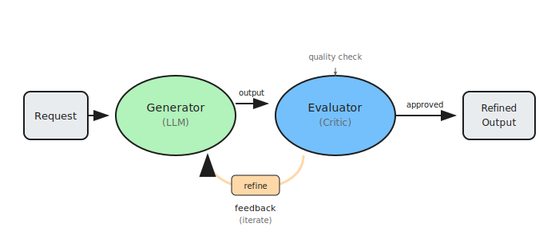

# Reflection: Self-Evaluation and Refinement

Reflection is a pattern where an agent evaluates its own output and uses that feedback to iteratively refine its response. This creates a self-improvement loop where one component generates a result, another evaluates or critiques it, and the feedback drives progressive refinement until quality criteria are met.

This pattern addresses the limitation of single-pass generation, which can produce inconsistent or suboptimal results. By building in self-critique and iteration, agents can catch errors, improve quality, and align outputs more closely with requirements—all without human intervention.

## How it works

1. **Generate initial output**: The agent produces an initial response, code, plan, or content based on the user's request
2. **Evaluate output**: A separate evaluation step (same or different model) critiques the output against quality criteria, correctness, style, or task requirements
3. **Generate feedback**: The evaluator produces structured feedback identifying issues, improvements, or suggestions
4. **Refine output**: The generator receives the feedback and produces an improved version addressing the identified issues
5. **Iterate or converge**: The loop continues until quality thresholds are met, a maximum iteration count is reached, or the evaluator approves the output

## Examples

- **Code generation**: Agent writes code → Reviews for bugs and inefficiencies → Refactors based on feedback → Tests and validates
- **Content writing**: Draft article → Evaluate for clarity and accuracy → Rewrite weak sections → Final polish
- **Translation**: Initial translation → Check for cultural nuances and accuracy → Refine problematic phrases → Verify consistency
- **Problem solving**: Propose solution → Critique assumptions and logic → Strengthen weak points → Validate approach
- **Data analysis**: Generate insights → Verify statistical validity → Correct methodology issues → Confirm conclusions

## Best for

- Tasks where output quality is critical and single-pass generation is unreliable
- Creative or subjective outputs that benefit from iterative refinement
- Code generation requiring correctness validation and optimization
- Scenarios where human review is expensive or unavailable
- Applications requiring built-in quality assurance and error detection
- Self-improving systems that learn from their own feedback over time
