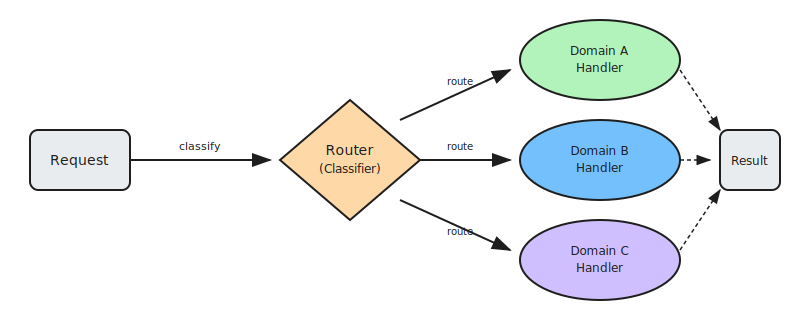

# Routing: Intelligent Request Distribution

Routing is a pattern that intelligently directs incoming requests to the most appropriate specialized agent, model, or workflow based on the request's intent, complexity, or domain. Rather than using a single general-purpose agent for all tasks, routing enables a system to leverage specialized capabilities where they're most effective.

This pattern optimizes for multiple dimensions: accuracy (by matching tasks to domain experts), cost (by using simpler models for straightforward requests), and latency (by avoiding unnecessary complexity). The router acts as an intelligent dispatcher that understands the nature of each request and knows the strengths of available handlers.

## How it works

1. **Receive request**: The router receives an incoming query or task from the user or system
2. **Classify intent**: The router analyzes the request to determine its type, domain, complexity, or required capabilities using classification models or rule-based logic
3. **Select handler**: Based on the classification, the router identifies the most appropriate agent, model, or workflow from the available options
4. **Forward request**: The request is dispatched to the selected handler along with any relevant context or metadata
5. **Return response**: The handler processes the request and returns the result, which the router may post-process before delivering to the user

## Examples

- **Domain routing**: "Explain quantum entanglement" → Science specialist agent; "Draft a contract clause" → Legal specialist agent
- **Complexity routing**: Simple FAQ → Small, fast model; Complex analysis → Large, capable model
- **Language routing**: Spanish query → Spanish-optimized model; Technical Japanese → Japanese technical specialist
- **Task type routing**: Code generation → Coding model; Creative writing → Creative model; Math problems → Reasoning model
- **Escalation routing**: Standard request → Automated agent; Edge case detected → Human expert queue

## Best for

- Systems handling diverse request types across multiple domains
- Cost optimization by matching request complexity to model capability
- Latency-sensitive applications where simpler requests need fast responses
- Multi-tenant platforms serving users with different needs
- Hybrid human-AI systems requiring intelligent escalation
- Applications where specialized models outperform general-purpose ones
