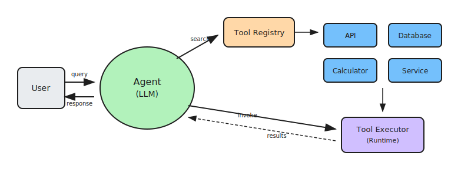

# Tool Use: Function Calling Agents

Tool Use is a pattern that extends the capabilities of reasoning agents by enabling them to invoke external functions, APIs, or services to complete tasks that go beyond language-only reasoning. The agent uses an LLM to decide which tool to use, generates the appropriate call arguments, executes the tool, and incorporates the tool's output back into its reasoning loop.

This pattern transforms agents from passive responders into active performers that can interact with real-world systems, databases, and services. The tool interface represents any callable capability—from simple calculations to complex API integrations.

## How it works

1. **Receive query**: The agent receives a natural-language query or task from the user or calling system
2. **Search for tools**: The agent uses internal metadata or a tool registry to identify available tools, their schemas, and capabilities
3. **Select and invoke**: The LLM analyzes the query alongside tool metadata (function names, input types, descriptions) and chooses the most relevant tool, constructing appropriate input arguments
4. **Execute tool**: The agent shell or tool runner executes the selected function and captures the result (API output, database value, computation result)
5. **Return response**: The LLM incorporates the tool results into its reasoning and returns a natural-language response to the user

## Examples

- **Data retrieval**: "What's the current stock price of ACME?" → calls financial API → returns formatted price with context
- **Calculations**: "Calculate the compound interest on $10,000 at 5% for 3 years" → invokes calculator function → explains the result
- **Database queries**: "Find all customers who purchased last month" → executes database query → summarizes findings
- **External services**: "Send a notification to the ops team about the deployment" → calls messaging API → confirms delivery
- **Multi-tool chains**: "Book a meeting room for tomorrow and send invites" → calendar API → email API → confirms both actions

## Best for

- Virtual assistants that need access to external data and services
- Tasks requiring real-time information beyond the model's training data
- Automation workflows that interact with APIs and databases
- Enterprise integrations connecting AI with existing business systems
- Scenarios where the agent needs to perform actions, not just provide information
- Applications requiring dynamic, context-aware tool selection
